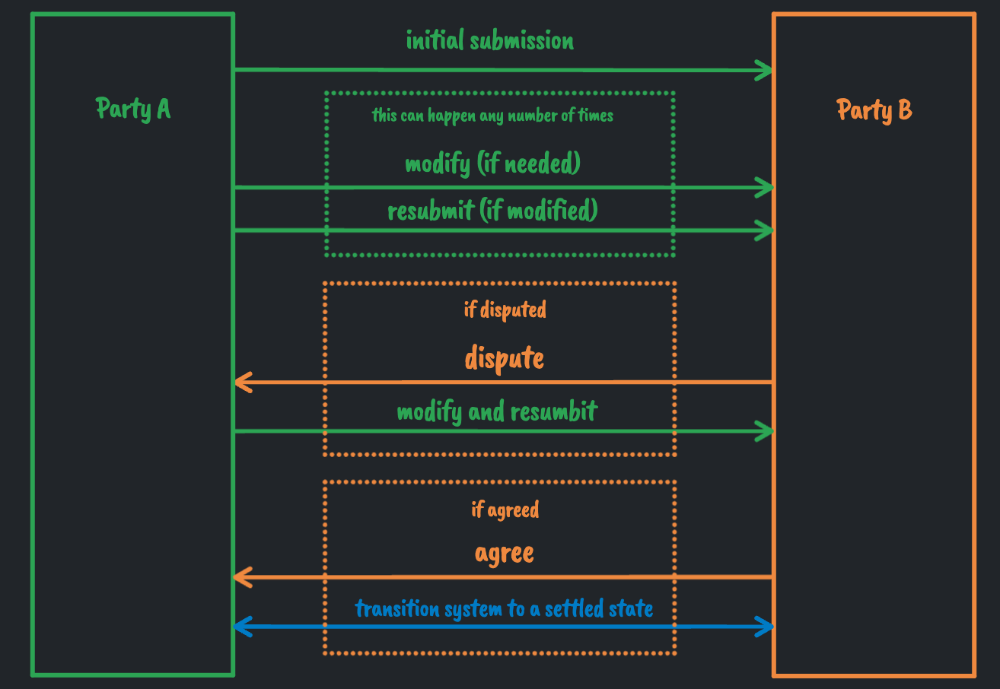

# Realtime Payment Settlement w/ Websockets

This repository contains a server and client implementation of a realtime settlement process using websockets. 
The server is written in NodeJS(express & express-ws) and the client is written in NextJS & tailwindcss. 
The server is responsible for handling the connection pools for two parties, A and B and the settlement process between them.
The client is responsible for connecting to the server and sending settlement requests from party A and B.

## How to run the project

- Clone the repository
- Run `yarn setup` in the root directory to install all dependencies for the server and client

- Running the server
  - Run `yarn start:server` to start the server 
    - *(Or `yarn dev:server` to start the server in development mode)*
  - You can visit `http://localhost:8080` in your browser to verify that the server is running

- Running the client
  - Make sure the server is running
  - Run `yarn start:client` to start the client 
    - *(Or `yarn dev:client` to start the client in development mode)*
  - You can visit `http://localhost:3000` in your browser to verify that the client is running
    - *(By default, the client tries to connect to the server at `ws://localhost:8080` for websocket communication. If you are running the server on a different port or different host, you must specify the server address in the `.env` file inside client directory as `NEXT_PUBLIC_WS_URL`)*
  
## How to use the app

- Once the server and client are running, you can open the client in two different browsers to simulate two parties, A and B.
  - ***Note***: *(Opening in same browser with different tabs **might not work** as the the client uses session storage to store the connection details)*
- On one of the clients, you can select the party as A and on the other client, you can select the party as B.
  - *(If one party has already created new connection, the other party will be able to join the connection by entering the connection id.)*
- You can then send a settlement request from party A to party B by entering the amount and clicking the `Submit` button.
- The settlement request will be sent to party B and party B can dispute or accept the settlement request.
- Party A can modify the request as many times as they want until party B responds to the request.
- If party B disputes the request, party A can modify the request and send it again. This process can be repeated until party B accepts the request.
- If party B accepts the request, the settlement is complete and we see the final screen with the settlement details.
- Afterwards, both the parties can leave the connection by clicking the `Leave` button.

## Settlement workflow

